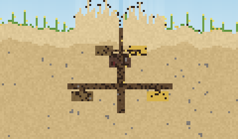

# antTime

เกมเลี้ยงมด (ant colony simulation) มุมมองภาคตัดขวางใต้ดินแบบพิกเซล — ผู้เล่นสั่งขุดอุโมงค์
กำหนดห้องต่าง ๆ แล้วปล่อยให้มดทำงานกันเอง: ขุดดิน ขนดินไปกองบนปากรัง ออกไปหาอาหาร
ป้อนตัวอ่อน และราชินีก็วางไข่ต่อไปเรื่อย ๆ



สร้างด้วย **Unity 6000.2.8f1** เป็น C# ล้วน ไม่มี asset ภายนอก ภาพทั้งหมดวาดเป็นพิกเซลลง
texture เดียว (1 tile = 1 pixel) แล้วขยายขึ้นจอ

## เริ่มเล่น

1. เปิดโปรเจกต์นี้ด้วย Unity Hub (Unity 6000.2.8f1)
2. เปิดฉาก `Assets/Scenes/Main.unity` แล้วกด **Play**

ทุกอย่างในเกมถูกสร้างจากโค้ดตอนรัน (`Game.Boot` ใน [Game.cs](Assets/Scripts/Game.cs)) ฉากจึงว่างเปล่า
ไม่ต้องลาก prefab หรือตั้งค่าอะไรเพิ่ม

ถ้าอยากได้ไฟล์ `.exe`: เมนู **AntTime → Build Windows Player** (ออกที่โฟลเดอร์ `Build/`)

> ถ้ากด Play แล้วขึ้น error เรื่อง input ให้ไปที่ Project Settings → Player → Active Input Handling
> แล้วเลือก *Input Manager (Old)* หรือ *Both* — เกมนี้ใช้ input ระบบเก่า

## วิธีเล่น

| ปุ่ม | ทำอะไร |
|---|---|
| ลากเมาส์ซ้าย | สั่งงานตามพู่กันที่เลือก |
| `1` | ขุดอุโมงค์ |
| `2` | ห้องอนุบาล (ราชินีจะวางไข่ที่นี่) |
| `3` | ห้องเสบียง (ที่เก็บอาหาร) |
| `4` | ห้องราชินี |
| `5` | ยกเลิกคำสั่ง / คืนห้องเป็นอุโมงค์ธรรมดา |
| `[` `]` | ปรับขนาดพู่กัน |
| ลากเมาส์ขวา / `WASD` | เลื่อนจอ |
| ล้อเมาส์ | ซูม |
| `Space` | หยุด / เล่น |
| `,` `.` | ลด / เพิ่มความเร็ว (x1 → x8) |
| `C` | กลับไปที่รัง |
| `H` | ซ่อน/แสดงคำอธิบาย |
| `F5` / `F9` | บันทึก / โหลด |
| `R` | สร้างโลกใหม่ (ต้องกดยืนยันอีกครั้ง) |

สั่งงานบนดินที่ยังตันอยู่ = มดจะมาขุด ส่วนถ้าสั่งบนอุโมงค์ที่ขุดไว้แล้ว = เปลี่ยนหน้าที่ห้องทันที

### เซฟ/โหลด

เกมบันทึกอัตโนมัติทุก 2 นาทีและตอนปิดเกม เปิดเกมครั้งหน้าจะเล่นต่อจากรังเดิมทันที
ส่วน `F5` / `F9` เป็นช่องเซฟแยกไว้กดเองเวลาจะลองอะไรเสี่ยง ๆ

ไฟล์เซฟอยู่ที่ `%USERPROFILE%\AppData\LocalLow\DefaultCompany\antTime\`
(`autosave.dat` กับ `save1.dat`) เป็น binary บีบ gzip ขนาดราว 45 KB ต่อไฟล์

**เป้าหมาย:** ขยายรังให้ใหญ่ขึ้นโดยไม่ให้อาหารขาด ยิ่งมีห้องอนุบาลมาก ราชินียิ่งวางไข่ได้มาก
แต่มดทุกตัวก็กินอาหาร และการขุดก็กินแรงงาน (ต้องขนดินขึ้นไปทิ้งบนผิวดินทีละก้อน)

## วงจรของเกม

```
ราชินีวางไข่ (ใช้เสบียง) → ไข่ → ตัวอ่อน (ต้องถูกป้อน 3 ครั้ง) → ดักแด้ → มดงานตัวใหม่
                                        ↑
มดหาอาหารบนผิวดิน → ขนกลับเข้าห้องเสบียง ──┘
มดขุดดิน → ขนดินขึ้นไปกองบนผิวดิน (กลายเป็นเนินดินปากรังจริง ๆ)
```

มดแบ่งหน้าที่เป็นนักขุด / นักหาอาหาร / พี่เลี้ยง แต่ถ้างานของตัวเองไม่มี ก็จะไปช่วยงานอื่น
และถ้าเสบียงในคลังใกล้หมด ทั้งรังจะทิ้งงานขุดไปหาอาหารก่อนโดยอัตโนมัติ

## โครงสร้างโค้ด

| ไฟล์ | หน้าที่ |
|---|---|
| [Tiles.cs](Assets/Scripts/Tiles.cs) | ชนิด tile, คำสั่งของผู้เล่น, จานสี |
| [World.cs](Assets/Scripts/World.cs) | ตาราง tile, สร้างภูมิประเทศ, กฎว่าช่องไหนมดเดินได้ |
| [Pathfinder.cs](Assets/Scripts/Pathfinder.cs) | A* 8 ทิศบน grid |
| [Entities.cs](Assets/Scripts/Entities.cs) | ข้อมูลมด / ไข่ / อาหาร |
| [Colony.cs](Assets/Scripts/Colony.cs) | simulation ทั้งหมด: งาน, AI มด, ราชินี, สมดุลอาหาร |
| [SaveGame.cs](Assets/Scripts/SaveGame.cs) | เขียน/อ่านไฟล์เซฟ (gzip + เขียนผ่านไฟล์ชั่วคราว) |
| [PixelRenderer.cs](Assets/Scripts/PixelRenderer.cs) | วาดทุกอย่างลง Texture2D เดียว |
| [Game.cs](Assets/Scripts/Game.cs) | บูตเกม, input, HUD, ลูปหลัก |

ค่าปรับสมดุลทั้งหมดอยู่รวมกันใต้หัวข้อ `---- ค่าปรับสมดุลเกม ----` ใน `Colony.cs`

## เครื่องมือสำหรับพัฒนา

เมนู **AntTime** ในตัว Editor:

- **Run Sim Smoke Test** — รัน simulation แบบไม่มีภาพหลาย seed แล้วรายงานว่ารังรอดไหม
  (ใช้จับบั๊กพวกรังอดตาย / มดขุดไม่ได้ โดยไม่ต้องนั่งดูเกมจริง)
- **Run Save-Load Test** — เซฟแล้วโหลดกลับ เทียบทุก tile ว่าตรงกัน แล้วเล่นต่ออีก 300 วิ
- **Render Preview PNG** — เรนเดอร์ภาพนิ่งของรังที่โตแล้วออกมาเป็นไฟล์ PNG
- **Build Windows Player** — build เป็น .exe

รันจาก command line ได้ด้วย เช่น

```bash
"C:\Program Files\Unity\Hub\Editor\6000.2.8f1\Editor\Unity.exe" -batchmode -nographics -quit -projectPath . -executeMethod AntTime.EditorTools.SimSmokeTest.Run -logFile -
```

ตั้ง `ANTTIME_SECONDS` เพื่อกำหนดว่าจะจำลองกี่วินาทีของเวลาในเกม (ค่าเริ่มต้น 300)

## ยังไม่มี (ไอเดียทำต่อ)

- ศัตรู เช่น มดต่างรัง แมงมุม และมดทหาร
- กลางวัน/กลางคืน, ฝนที่ทำให้อุโมงค์ถล่ม
- ฟีโรโมนเป็นเส้นทางเดิน (ตอนนี้ใช้ A* ตรง ๆ)
- มดหลายสายพันธุ์ / ระบบเลี้ยงเพลี้ยหรือเพาะเห็ดแบบมดตัดใบ
